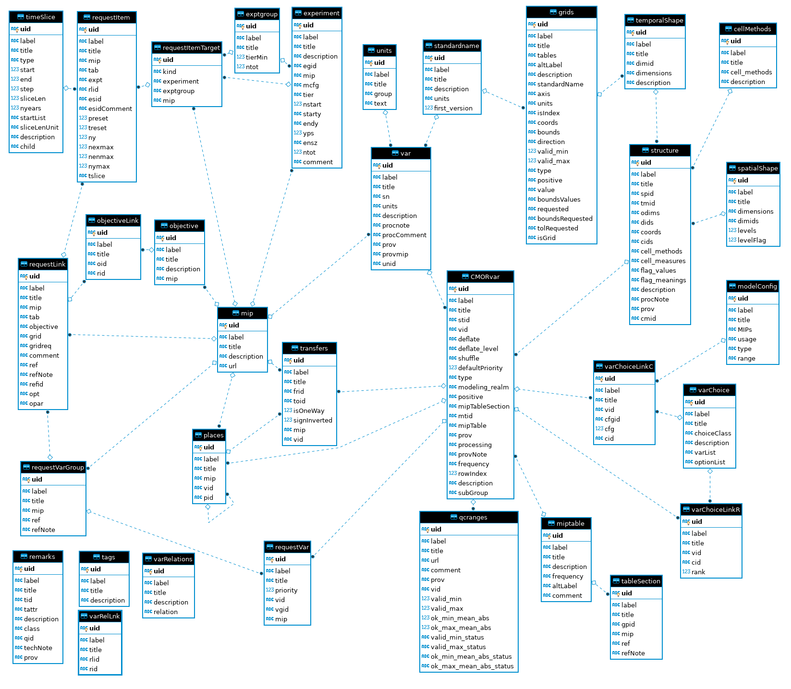

# CMIP6 data request to sqlite db

## Overview

In this repo there are some tools to create a sqlite database that contains the
CMIP6 data request.

It consists of three programs.

- The first is `dreqxml_to_sqlite.py`, which creates an output file that
  contains the sql commands to setup a new database from scratch.

- This can be turned into a sqlite database with the command
  `sqlite3 dreq.sqlite <dreq.sql`, using common input redirection.
  The other two programs modify the resulting sqlite database (`dreq.sqlite`)
  in-place.

- The second program is `manual_fixes.py`, which applies three material fixes
  to the data request (see below).

- The third program is `check_consistency.py`, which adds foreign key relations
  to the database, thus ensuring present and future integrity.

The result of running these programs on the xml form of the data request is a
sqlite database that contains the same information, but with added guarantees
about the integrity, ie all modeled relations are sure to hold, and with the
benefit of the powerful standard interface that is SQL.

## Resulting database

### Overview

Having cast the data request in the form of an sqlite database, we can now
explore the relationships between the various entities that make up the
database.

This diagram shows all modeled relationships with two exceptions:

If we kept the global uid table, every entity in this diagram has a link to
that table. Since this is a very simple relationship that would clutter the
picture a lot, we have removed the representation of this table from the
diagram.

The second exception are the annex tables that have been added recently and
are not yet fully integrated.

### Other Benefits

With the database in a standard form, we can now query the contained
information for all possible questions simply using SQL, without any further
programming being required.

We can also exploit the rich ecosystem of libraries and frameworks that has
been developed for use with relational databases (see outlook).

## Changes to the data request

In the course of working with the database some problems with the data in the
xml form of the data request have been identified.
They have been added to the xml files as far as possible and are fixed in the
`manual_fixes.py` program otherwise. Apart from typos and missing links in the
original data, two issues had to be addressed to put the data request into the
present format:

- Some `standardnames` are used in the data request that are actually not part
  of the official CF convention's standard name table. Because of that, they
  have not been included in the standard name section of the data request and
  consequently cannot be referenced into that original table.
  This has been addressed by adding a new column to the standard name table
  that contains the earliest version of the official CF convention's standard
  name table in which this name is present. This allowed us to add the missing
  standard names as new rows into the table with this field being set to
  `null`, thus marking standard names that are not part of the CF conventions.
  This way, all references to standard names can be references to the standard
  name table, thus ensuring structural integrity.

- The second change is to the way that `requestItem`s relate to experiments.
  In the data request `requestItems` relate to experiments via their `esid`
  attribute. However, this can not only point to an experiment (`experiment`),
  but also to an experiment group (`exptgroup`) or a mip (`mip`). Since all
  three of these entities live in different tables, it is not possible to model
  this relationship with a single foreign key relationship.
  This problem has been adressed by the introduction of a new intermediate
  table, `requestItemTarget`, that serves as the target for the `esid` field in
  the `requestItem` table and relates those to any one of the three possible
  final targets.

## Outlook

The structured format of the database allows us to exploit frameworks like
[django](https://www.djangoproject.com/) to build rich applications on top of
the data request, probably starting with a comfortable editor that makes it
easy to extent and develop the data request with the comfort of guarateed
structural integrity.

The universal availability of sql systems also means that we can provide the
data request in a language agnostic form, furthering adoption in different
communities.

The well-known, well-understood, and relied-upon nature of the relational
database design allows users to come up with novel ways to query and use the
data request.

If the database approach is adopted with a different system (such as postgresql
or mariadb), and/or with a different underlying schema, perhaps informed by
the ISO metadata registry standard, the mass transfer of the existing data
request into that new system will be easier and quicker starting from a
consistent relational model.
